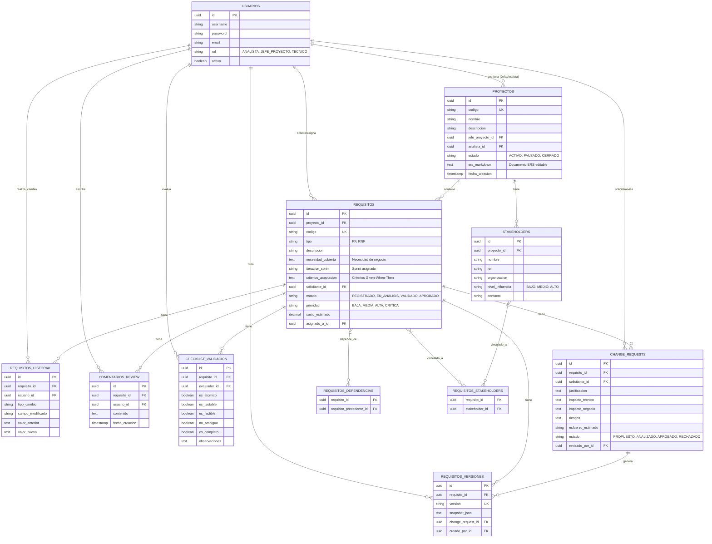

# Modelo de Datos V2 - Sistema de Gestión de Requisitos (REM)

Este documento describe la estructura de la base de datos del sistema REM v2, incluyendo la gestión de proyectos, requisitos, stakeholders, validación, gestión de cambios y trazabilidad.

## 1. Diagrama de Entidad-Relación (Mermaid)

## 2. Tablas (11 en total)

| # | Tabla | Módulo | Descripción |
|---|-------|--------|-------------|
| 1 | `usuarios` | Auth | Usuarios con roles (ANALISTA, JEFE_PROYECTO, TECNICO) |
| 2 | `proyectos` | Core | Proyectos con ERS Markdown integrado |
| 3 | `stakeholders` | **Captura** | Partes interesadas del proyecto |
| 4 | `requisitos` | **Captura** | Requisitos RF/RNF con campos ERS enriquecidos |
| 5 | `requisitos_stakeholders` | **Captura** | Relación N:M Requisitos ↔ Stakeholders |
| 6 | `requisitos_dependencias` | **Especificación** | Trazabilidad entre requisitos |
| 7 | `requisitos_historial` | **Gestión de Cambios** | Auditoría inmutable de cambios |
| 8 | `comentarios_review` | **Validación** | Hilos de discusión (Peer Review) |
| 9 | `checklist_validacion` | **Validación** | Checklist de calidad (5 criterios) |
| 10 | `change_requests` | **Gestión de Cambios** | Solicitudes formales de cambio |
| 11 | `requisitos_versiones` | **Gestión de Cambios** | Snapshots inmutables de versiones |

## 3. Archivos SQL

- **Schema completo:** `src/main/resources/db/schema.sql`
- **Migración incremental:** `src/main/resources/db/migration_v2.sql` (para ejecutar sobre BD existente)

## 4. Evaluación del Modelo V2

| Aspecto | Estado | Observación |
|---|---|---|
| Captura de Stakeholders | ✅ Nuevo | Tabla `stakeholders` + puente `requisitos_stakeholders` |
| Campos ERS enriquecidos | ✅ Nuevo | `necesidad_cubierta`, `iteracion_sprint`, `criterios_aceptacion` |
| Documento ERS Markdown | ✅ Nuevo | Campo `ers_markdown` en `proyectos` |
| Peer Review | ✅ Nuevo | Tabla `comentarios_review` |
| Checklist Validación | ✅ Nuevo | Tabla `checklist_validacion` con 5 criterios booleanos |
| Change Requests (CCB) | ✅ Nuevo | Tabla `change_requests` con análisis de impacto |
| Versionado Explícito | ✅ Nuevo | Tabla `requisitos_versiones` con snapshots JSON |
| Trazabilidad | ✅ Existente | Tabla `requisitos_dependencias` |
| Auditoría | ✅ Existente | Tabla `requisitos_historial` |

> **Resultado:** El modelo V2 cubre completamente los 4 módulos del ciclo de vida de requisitos: Captura, Especificación, Validación y Gestión de Cambios.
