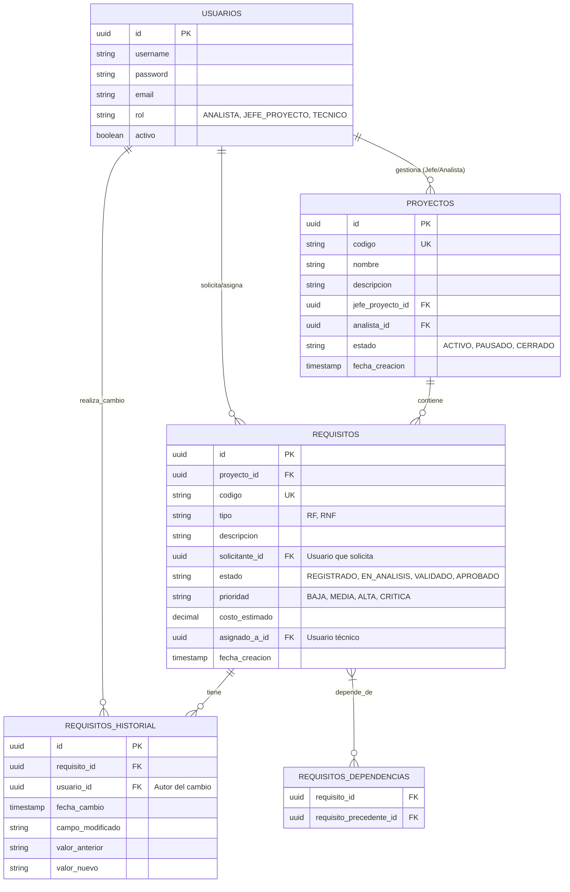

# Modelo de Datos - Sistema de Gestión de Requisitos (REM)

Este documento describe la estructura de la base de datos necesaria para soportar las funcionalidades del sistema REM, incluyendo la gestión de proyectos, requisitos, trazabilidad e historial de cambios.

## 1. Diagrama de Entidad-Relación (Mermaid)



## 2. Definición SQL (PostgreSQL)

A continuación, se presenta el código SQL para desplegar el modelo en una base de datos real. El archivo SQL ejecutable se encuentra en: **`src/main/resources/db/schema.sql`**

```sql
-- Extensiones necesarias
CREATE EXTENSION IF NOT EXISTS "uuid-ossp";

-- 1. Tabla de Usuarios
CREATE TABLE usuarios (
    id UUID PRIMARY KEY DEFAULT uuid_generate_v4(),
    username VARCHAR(50) UNIQUE NOT NULL,
    password VARCHAR(255) NOT NULL,
    email VARCHAR(100) UNIQUE NOT NULL,
    rol VARCHAR(20) CHECK (rol IN ('ANALISTA', 'JEFE_PROYECTO', 'TECNICO')) NOT NULL,
    activo BOOLEAN DEFAULT TRUE,
    fecha_creacion TIMESTAMP DEFAULT CURRENT_TIMESTAMP
);

-- 2. Tabla de Proyectos
CREATE TABLE proyectos (
    id UUID PRIMARY KEY DEFAULT uuid_generate_v4(),
    codigo VARCHAR(20) UNIQUE NOT NULL,
    nombre VARCHAR(100) NOT NULL,
    descripcion TEXT,
    jefe_proyecto_id UUID REFERENCES usuarios(id),
    analista_id UUID REFERENCES usuarios(id),
    estado VARCHAR(20) CHECK (estado IN ('ACTIVO', 'PAUSADO', 'CERRADO')) DEFAULT 'ACTIVO',
    fecha_creacion TIMESTAMP DEFAULT CURRENT_TIMESTAMP
);

-- 3. Tabla de Requisitos
CREATE TABLE requisitos (
    id UUID PRIMARY KEY DEFAULT uuid_generate_v4(),
    proyecto_id UUID REFERENCES proyectos(id) ON DELETE CASCADE,
    codigo VARCHAR(20) UNIQUE NOT NULL,
    tipo VARCHAR(5) CHECK (tipo IN ('RF', 'RNF')) NOT NULL,
    descripcion TEXT NOT NULL,
    solicitante_id UUID REFERENCES usuarios(id),
    estado VARCHAR(20) CHECK (estado IN ('REGISTRADO', 'EN_ANALISIS', 'VALIDADO', 'APROBADO')) DEFAULT 'REGISTRADO',
    prioridad VARCHAR(20) CHECK (prioridad IN ('BAJA', 'MEDIA', 'ALTA', 'CRITICA')) DEFAULT 'MEDIA',
    costo_estimado DECIMAL(10, 2),
    asignado_a_id UUID REFERENCES usuarios(id),
    fecha_creacion TIMESTAMP DEFAULT CURRENT_TIMESTAMP
);

-- 4. Tabla de Historial de Cambios
CREATE TABLE requisitos_historial (
    id UUID PRIMARY KEY DEFAULT uuid_generate_v4(),
    requisito_id UUID REFERENCES requisitos(id) ON DELETE CASCADE,
    usuario_id UUID REFERENCES usuarios(id),
    fecha_cambio TIMESTAMP DEFAULT CURRENT_TIMESTAMP,
    campo_modificado VARCHAR(50),
    valor_anterior TEXT,
    valor_nuevo TEXT
);

-- 5. Tabla de Dependencias (Trazabilidad entre requisitos)
CREATE TABLE requisitos_dependencias (
    requisito_id UUID REFERENCES requisitos(id) ON DELETE CASCADE,
    requisito_precedente_id UUID REFERENCES requisitos(id) ON DELETE CASCADE,
    PRIMARY KEY (requisito_id, requisito_precedente_id)
);

-- Índices para optimización
CREATE INDEX idx_requisitos_proyecto ON requisitos(proyecto_id);
CREATE INDEX idx_requisitos_estado ON requisitos(estado);
CREATE INDEX idx_requisitos_tipo ON requisitos(tipo);
CREATE INDEX idx_requisitos_asignado ON requisitos(asignado_a_id);
CREATE INDEX idx_historial_requisito ON requisitos_historial(requisito_id);
CREATE INDEX idx_historial_fecha ON requisitos_historial(fecha_cambio);
CREATE INDEX idx_proyectos_estado ON proyectos(estado);
CREATE INDEX idx_proyectos_jefe ON proyectos(jefe_proyecto_id);
```

## 3. Justificación del Modelo

1.  **UUIDs:** Se utilizan identificadores únicos universales para mayor seguridad y facilidad de migración/sincronización.
2.  **Integridad Referencial:** Se aplican `FOREIGN KEY` con restricciones `ON DELETE CASCADE` en tablas dependientes (historial y dependencias) para mantener la limpieza de datos.
3.  **Auditabilidad:** La tabla `requisitos_historial` cumple con el requisito **RF-004**, permitiendo rastrear qué cambió, quién lo hizo y cuándo.
4.  **Trazabilidad:** La tabla `requisitos_dependencias` permite manejar la "Precedencia" mencionada en el **RF-002**, permitiendo que un requisito dependa de uno o varios anteriores.
5.  **Roles y Estados:** Se utilizan `CHECK constraints` para asegurar que los datos coincidan con las reglas de negocio definidas en el ERS.
6.  **Índices de Optimización:** Se incluyen índices adicionales sobre campos de filtrado frecuente (`estado`, `tipo`, `asignado_a_id`, `fecha_cambio`, `jefe_proyecto_id`) para cumplir con los requisitos de rendimiento **RR-01** y **RR-03**.

## 4. Archivo SQL Ejecutable

El script SQL completo con comentarios detallados y trazabilidad a requisitos del ERS se encuentra en:

📄 **`src/main/resources/db/schema.sql`**

Este archivo contiene:
- Creación de extensiones (`uuid-ossp`)
- 5 tablas: `usuarios`, `proyectos`, `requisitos`, `requisitos_historial`, `requisitos_dependencias`
- 8 índices de optimización
- Comentarios con referencias a requisitos del ERS (RF-002, RF-003, RF-004)

## 5. Evaluación del Modelo

| Aspecto | Estado | Observación |
|---|---|---|
| Cobertura de RF-001 (Proyectos) | ✅ Completo | Tabla `proyectos` con todos los campos requeridos |
| Cobertura de RF-002 (Requisitos) | ✅ Completo | Tabla `requisitos` + `requisitos_dependencias` |
| Cobertura de RF-003 (Trazabilidad) | ✅ Completo | Campo `asignado_a_id` en `requisitos` |
| Cobertura de RF-004 (Historial) | ✅ Completo | Tabla `requisitos_historial` con auditoría completa |
| Cobertura de RF-005 (Exportación) | ✅ Completo | Consultas sobre `requisitos` + `proyectos` |
| Integridad referencial | ✅ Completo | Foreign keys con `ON DELETE CASCADE` |
| Seguridad (AS-01) | ✅ Completo | Campo `password` VARCHAR(255) para hash encriptado |
| Rendimiento (RR-01, RR-03) | ✅ Completo | 8 índices sobre campos de consulta frecuente |

> **Resultado:** El modelo de datos no requiere modificaciones estructurales. Cubre fielmente todos los requisitos funcionales y no funcionales del ERS.
